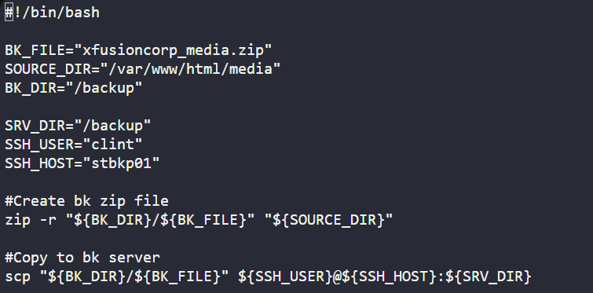

Task : Creat script to backup and zip data on App server
       Copy backup zip file to Backup server

cmd >> touch /scripts/example.sh        #Create script file
cmd >> chmod 775 /scripts/example.sh    #Change permission for script file
cmd >> vi /scripts/example.sh
cmd >> chown -R appserveruser:appserveruser /backup     #Change owner permission for backup folder

cmd >> ssh-keygen       #Create ssh-key
cmd >> ssh-copy-id clint@backupserver       #copy ssh-key to backup server

