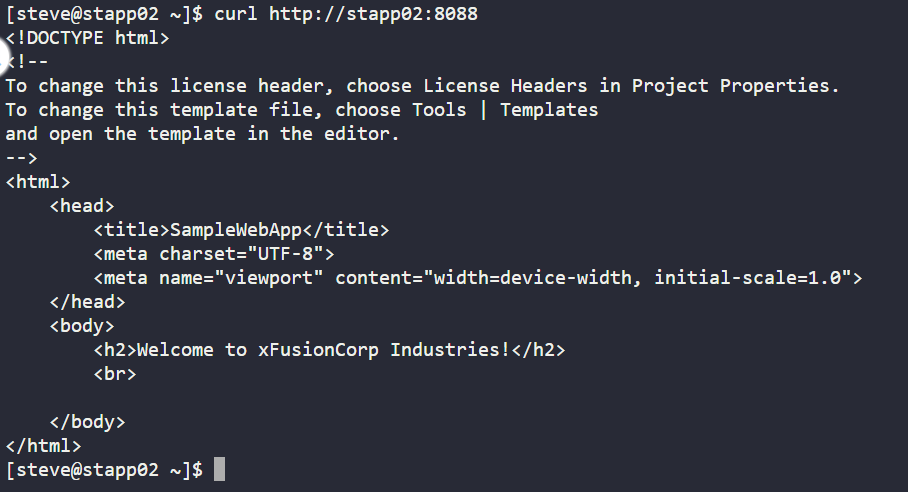

Task : Install tomcat server on app server and deploy root.war project.
a. Install tomcat server on App Server 2.
b. Configure it to run on port 8088.
c. There is a ROOT.war file on Jump host at location /tmp.

cmd >> scp ROOT.war appsvr2user@appsvrhost      #Copy ROOT.war jump host to app server 2

cmd >> sudo yum install tomcat -y               #Install tomcat server on app server 2
cmd >> vi /etc/tomcat/server.xml                #Edit tomcat config to change port
cmd >> sudo systemctl start tomcat
cmd >> sudo systemctl enable tomcat
cmd >> mv ROOT.war /var/lib/tomcat/webapps      #Move ROOT.war to tomcat root folder

cmd >> curl http://stapp02:8088

