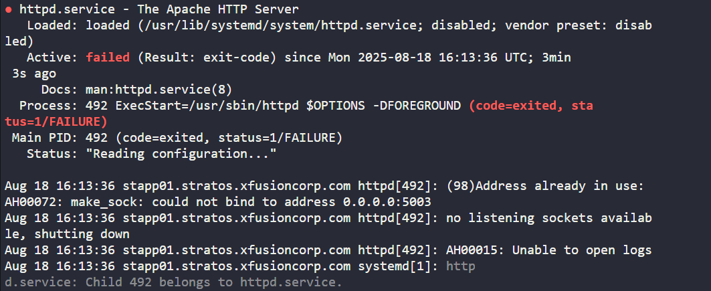

Task : open apache tcp port in firewall

cmd >> sudo systemctl status httpd              #Check apache service status

                       #Port 5003 could not bind 

cmd >> sudo netstat -tulnp | grep 5003          #Check which service using prot 5003

                       #Sendmail service using port 5003

cmd >> sudo systemctl stop sendmail
cmd >> sudo systemctl disable sendmail          #stop&disable service

cmd >> sudo systemctl start httpd               
cmd >> sudo systemctl enable httpd              #Start&enable apache service

cmd >> sudo iptables -L -n --list-numbers       #Check iptables listing
cmd >> sudo iptables -I INPUT 4 -p tcp --dport 5003 -j ACCEPT  #Add port to iptables (firewall)