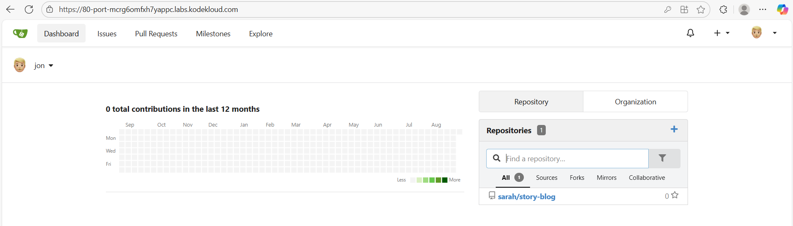
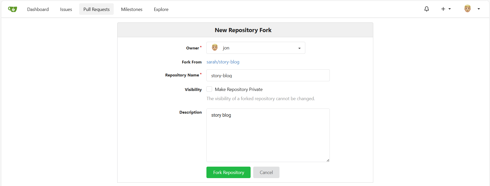
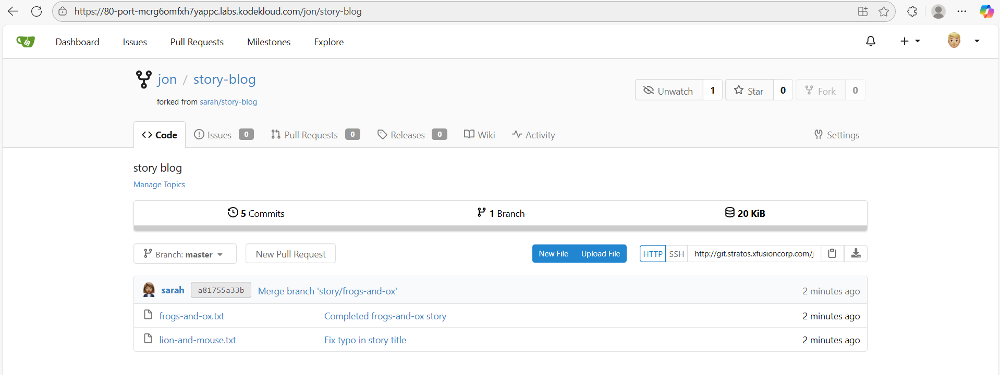

Task:
1. Click on the Gitea UI button located on the top bar to access the Gitea page.
2. Login to Gitea server using username jon and password Jon_pass123.
3. Once logged in, locate the Git repository named sarah/story-blog and fork it under the jon user.

# Login Gitea server

# Fork repository

