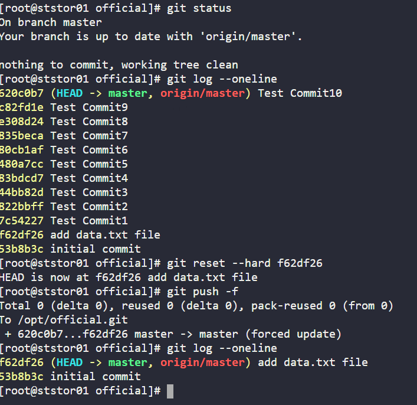

Task: 
1. In /usr/src/kodekloudrepos/official git repository, reset the git commit history so that there are only two commits in the commit history i.e initial commit and add data.txt file.

2. Also make sure to push your changes.

# Git hard reset to specific commit
cd /usr/src/kodekloudrepos/official/
git log --oneline
git reset --hard f62df26
git push -f

