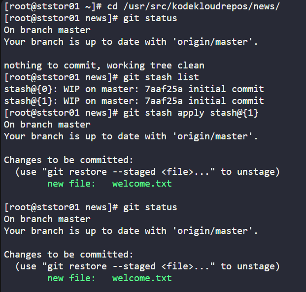

Task : Look for the stashed changes under /usr/src/kodekloudrepos/news git repository, and restore the stash with stash@{1} identifier. Further, commit and push your changes to the origin.

# Check git stash list      [git stach = temporary storage ]
cd /usr/src/kodekloudrepos/news/
git stash list

# Restore git stash & push to master
git stash apply stash@{1}    / git stash pop stash@{1}
git commit -m "apply stash@{1}"
git push

