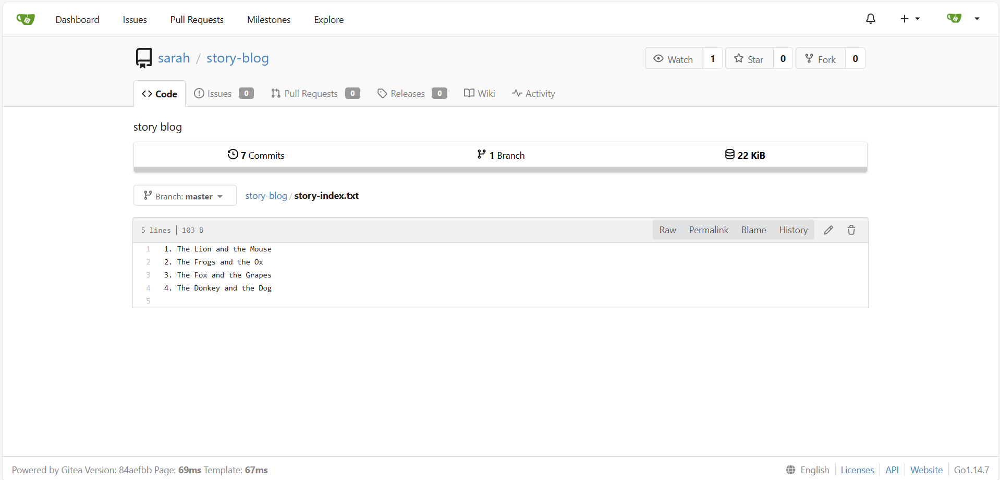

Task:
SSH into storage server using user max and password Max_pass123. Under /home/max you will find the story-blog repository. Try to push the changes to the origin repo and fix the issues. The story-index.txt must have titles for all 4 stories. Additionally, there is a typo in The Lion and the Mooose line where Mooose should be Mouse.

# Fix story-index.txt
cd story-blog/
vi story-index.txt
git add story-index.txt
git commit -m "fix story-index"

# Git pull and fix confilt file
git pull --rebase
vi story-index.txt
git add story-index.txt
git commit -m "fix story-index"
git rebase --continue
git push

# Check by Gitea UI
