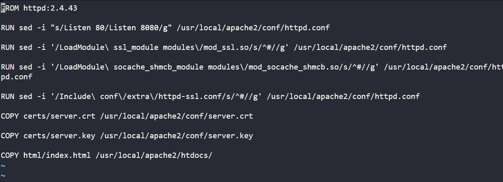

Task:
a. The Dockerfile is placed on App Server 3 under /opt/docker directory.

b. Fix the issues with this file and make sure it is able to build the image.

c. Do not change base image, any other valid configuration within Dockerfile, or any of the data been used — for example, index.html.

# Check & build Dockerfile
cd /opt/docker
docker build -t mylab .
# build failed and httpd.conf file path is missing

# Run httpd container & check httpd.conf file path
docker pull httpd:2.4.43
docker run -d --name httpd httpd:2.4.43
docker exec -it container_name sh
# /usr/local/apache2/conf/httpd.conf (httpd.conf file path)

# Fix Dockerfile

