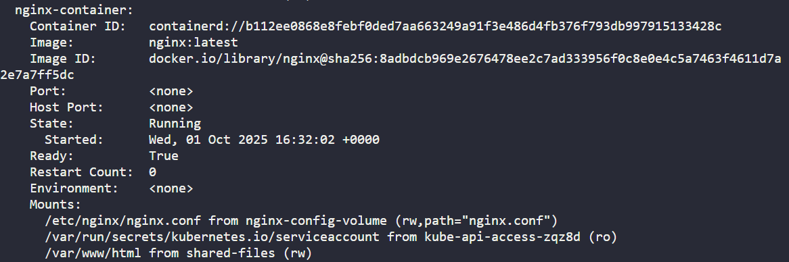

Task:
The pod name is nginx-phpfpm and configmap name is nginx-config. Identify and fix the problem.

Once resolved, copy /home/thor/index.php file from the jump host to the nginx-container within the nginx document root. After this, you should be able to access the website using Website button on the top bar.

# Check configmap 
k get cm
k describe cm nginx-config   
    # nginx root direcotry : /var/www/html

# Check pod and container
k get po
k describe po nginx-phpfpm

    # The directory of mounting  volume is wrong.

# Edit container and apply pod with force
k edit po nginx-phpfpm
    # Edit volume mounting directory - /var/www/html
k apply -f /tmp/kubectl-edit-3541414856.yaml --force

# Copy file to container
k cp /home/thor/index.php nginx-phpfpm:/var/www/html -c nginx-container
k exec -it nginx-phpfpm -c nginx-container -- sh