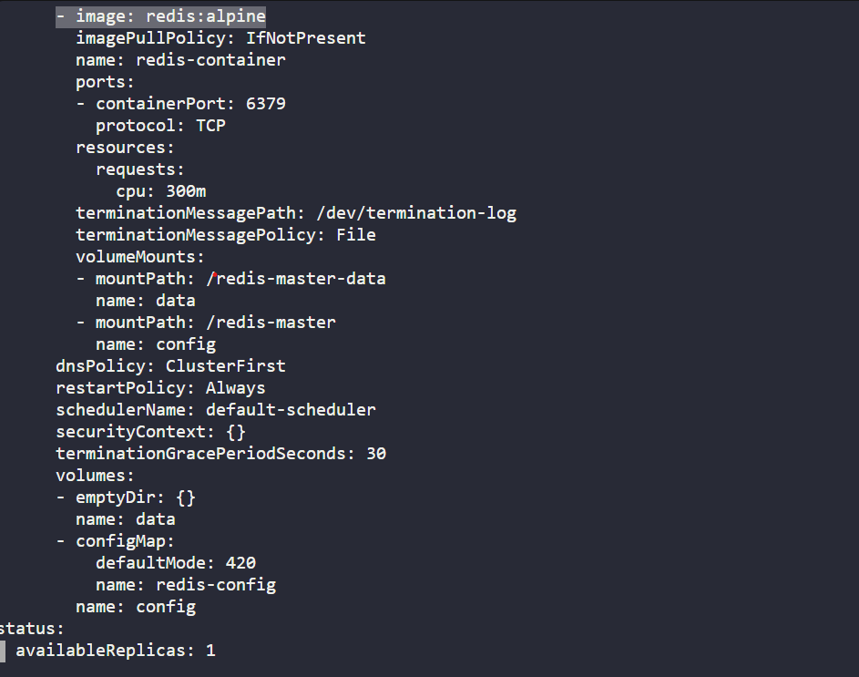

Task: The deployment name is redis-deployment. The pods are not in running state right now, so please look into the issue and fix the same.

# Check deployment error
k get deploy
k describe deploy redis-deployment
k edit deploy redis-deployment

# Edit image=alpine, redis-config

k get deploy