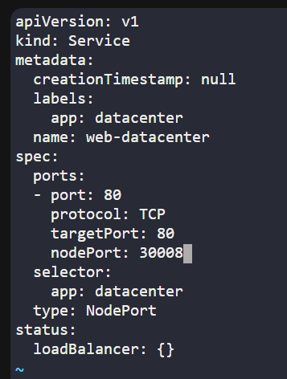

Task:
1. Create a PersistentVolume named as pv-datacenter. Configure the spec as storage class should be manual, set capacity to 5Gi, set access mode to ReadWriteOnce, volume type should be hostPath and set path to /mnt/finance (this directory is already created, you might not be able to access it directly, so you need not to worry about it).

2. Create a PersistentVolumeClaim named as pvc-datacenter. Configure the spec as storage class should be manual, request 2Gi of the storage, set access mode to ReadWriteOnce.

3. Create a pod named as pod-datacenter, mount the persistent volume you created with claim name pvc-datacenter at document root of the web server, the container within the pod should be named as container-datacenter using image nginx with latest tag only (remember to mention the tag i.e nginx:latest).

4. Create a node port type service named web-datacenter using node port 30008 to expose the web server running within the pod.

# Creat PersistenctVolume
vi pv.yaml
    # Write pv.yaml
k apply -f pv.yaml

# Create PersistentVolumeClaim
vi pvc.yaml
    # Write pvc.yaml
k apply -f pvc.yaml

# Create pod
vi pod.yaml
    # Write pod.yaml
k apply -f pod.yaml

# Create service to expose port
k expose po pod-datacenter --name=web-datacenter --type=NodePort --port=80 --selector="app=datacenter" --dry-run=client -o yaml > service.yaml
vi service.yaml
    # Add nodePort

k apply -f service.yaml 

# Write index.html to accessible website
k exec -it pod-datacenter -c container-datacenter -- sh
cd /usr/share/nginx/html
touch index.html
echo "Hello World" > index.html

