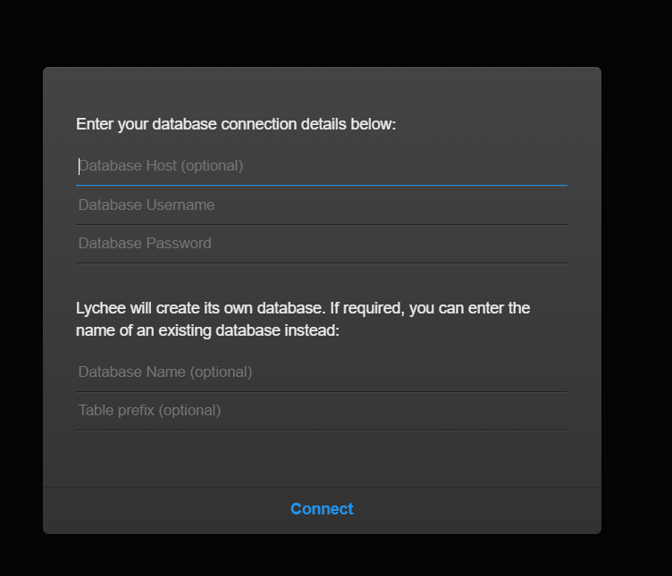

# Create namespace
k create ns iron-namespace-devops

# Create devployment
vi gal-deploy.yaml    # Write gal-deploy.yaml
k apply -f gal-deploy.yaml

vi db-deploy.yaml    # Write db-deploy.yaml
k apply -f db-deploy.yaml

# Create service to expose port
vi db-svc.yaml    # Write db-svc.yaml
k apply -f db-svc.yaml

vi gal-svc.yaml    # Write gal-svc.yaml
k apply -f gal-svc.yaml

# Check the result by webUI

