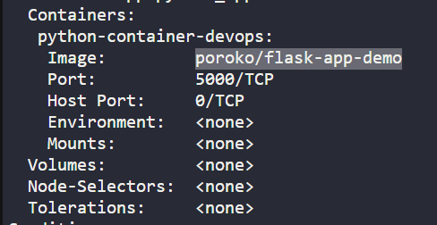

Task:
1. The deployment name is python-deployment-devops, its using poroko/flask-demo-appimage. The deployment and service of this app is already deployed.

2. nodePort should be 32345 and targetPort should be python flask app's default port.

# Check deployment and pod
k get deploy
k get po
k describe deploy python-deployment-devops  
# Edit image name

poroko/flask-app-demo >> poroko/flask-demo-app

# Check service [default port is 5000]
k get svc
k edit svc python-service-devops
default port = 5000
target port = 5000

