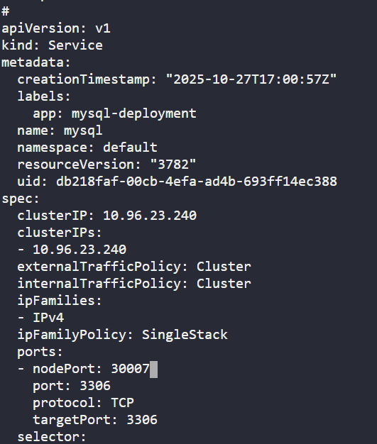

Task:
1.) Create a PersistentVolume mysql-pv, its capacity should be 250Mi, set other parameters as per your preference.

2.) Create a PersistentVolumeClaim to request this PersistentVolume storage. Name it as mysql-pv-claim and request a 250Mi of storage. Set other parameters as per your preference.

3.) Create a deployment named mysql-deployment, use any mysql image as per your preference. Mount the PersistentVolume at mount path /var/lib/mysql.

4.) Create a NodePort type service named mysql and set nodePort to 30007.

5.) Create a secret named mysql-root-pass having a key pair value, where key is password and its value is YUIidhb667, create another secret named mysql-user-pass having some key pair values, where frist key is username and its value is kodekloud_gem, second key is password and value is Rc5C9EyvbU, create one more secret named mysql-db-url, key name is database and value is kodekloud_db10

6.) Define some Environment variables within the container:

a) name: MYSQL_ROOT_PASSWORD, should pick value from secretKeyRef name: mysql-root-pass and key: password

b) name: MYSQL_DATABASE, should pick value from secretKeyRef name: mysql-db-url and key: database

c) name: MYSQL_USER, should pick value from secretKeyRef name: mysql-user-pass key key: username

d) name: MYSQL_PASSWORD, should pick value from secretKeyRef name: mysql-user-pass and key: password

# Create secret for mysql 
k create secret generic mysql-root-pass --from-literal=password=YUIidhb667
k create secret generic mysql-user-pass --from-literal=username=kodekloud_gem --from-literal=password=Rc5C9EyvbU
k create secret generic mysql-db-url --from-literal=database=kodekloud_db10

# Create PersistentVolume, PersistentVolumeClaim and Deployment 
# Template from kubernetes.io
https://kubernetes.io/docs/tasks/configure-pod-container/configure-persistent-volume-storage/

vi mysql.yaml  # Write deployment.yaml
k apply -f mysql.yaml
k get pvc
k get pv
k get deploy

# Crate service port
k expose deploy mysql-deployment --name=mysql --type=NodePort
k get svc
# Edit mysql service port
k edit svc   # edit NodePort

k get svc

# Check mysql database
 exec -it mysql-deployment-797b79677b-b476f --bash
 mysql -u root -p
