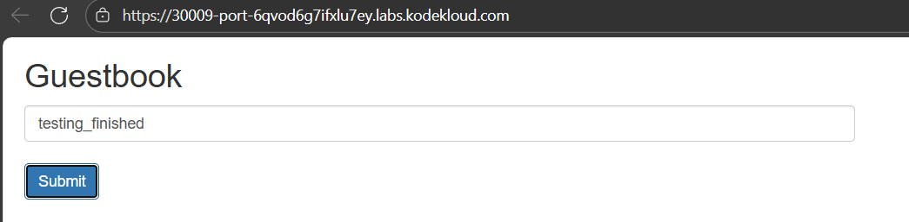

BACK-END TIER

Create a deployment named redis-master for Redis master.

a.) Replicas count should be 1.

b.) Container name should be master-redis-devops and it should use image redis.

c.) Request resources as CPU should be 100m and Memory should be 100Mi.

d.) Container port should be redis default port i.e 6379.

Create a service named redis-master for Redis master. Port and targetPort should be Redis default port i.e 6379.

Create another deployment named redis-slave for Redis slave.

a.) Replicas count should be 2.

b.) Container name should be slave-redis-devops and it should use gcr.io/google_samples/gb-redisslave:v3 image.

c.) Requests resources as CPU should be 100m and Memory should be 100Mi.

d.) Define an environment variable named GET_HOSTS_FROM and its value should be dns.

e.) Container port should be Redis default port i.e 6379.

Create another service named redis-slave. It should use Redis default port i.e 6379.

FRONT END TIER

Create a deployment named frontend.

a.) Replicas count should be 3.

b.) Container name should be php-redis-devops and it should use gcr.io/google-samples/gb-frontend@sha256:a908df8486ff66f2c4daa0d3d8a2fa09846a1fc8efd65649c0109695c7c5cbff image.

c.) Request resources as CPU should be 100m and Memory should be 100Mi.

d.) Define an environment variable named as GET_HOSTS_FROM and its value should be dns.

e.) Container port should be 80.

Create a service named frontend. Its type should be NodePort, port should be 80 and its nodePort should be 30009.

Finally, you can check the guestbook app by clicking on App button.

# Create master deployment and service port
k create deploy redis-master --image=redis --dry-run=client -o yaml     # create template by --dry-run
vi master.yaml          # Write master.yaml
k apply -f master.yaml
k get deploy

k expose deploy redis-master --name=redis-master --port 6379
k get svc

# Create slave deployment and service port
vi slave.yaml   # Write slave.yaml
k apply -f slave.yaml
k get deploy

k expose deploy redis-slave --name=redis-slave --port 6379
k get svc

# Create frontend deployment and service port
vi frontend.yaml    # Write frontend.yaml
k apply -f frontend.yaml
k get deploy

k expose deploy frontend --name=frontend --type=NodePort --port=80
k get svc
k edit svc frontend         # Edit nodePort
k get svc

# Check guestbook app by click button

