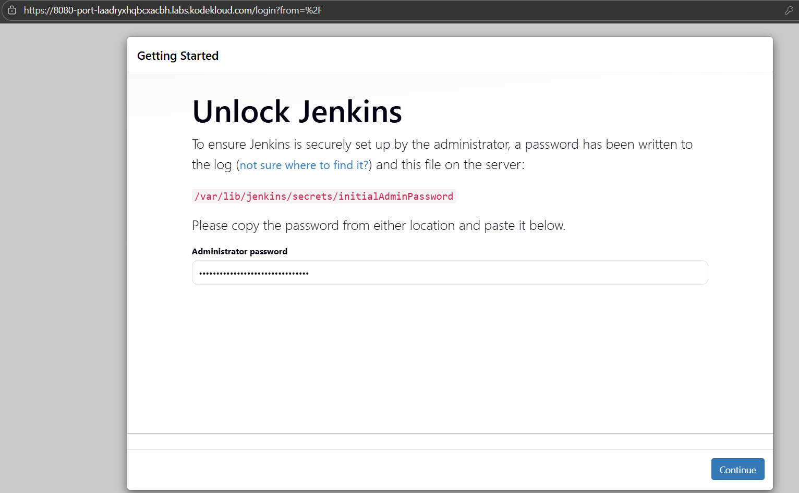
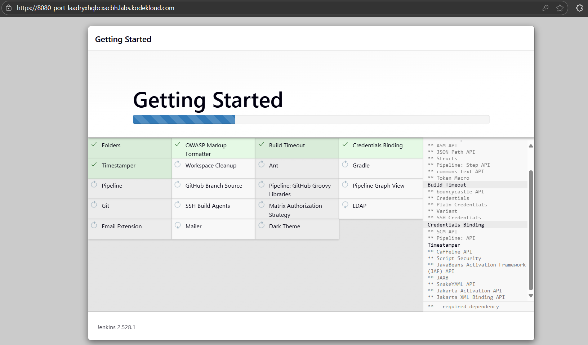
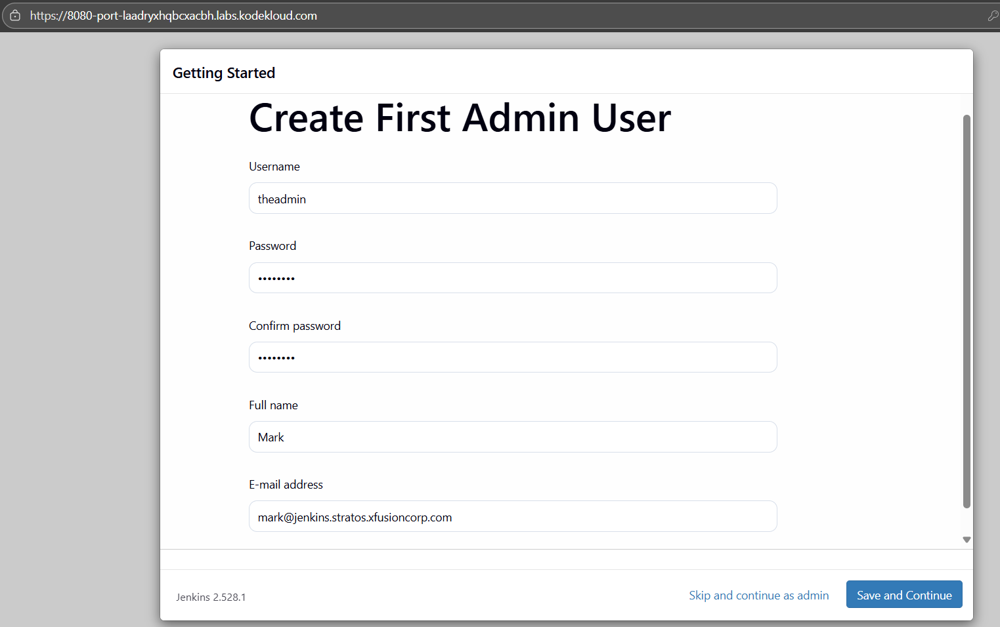
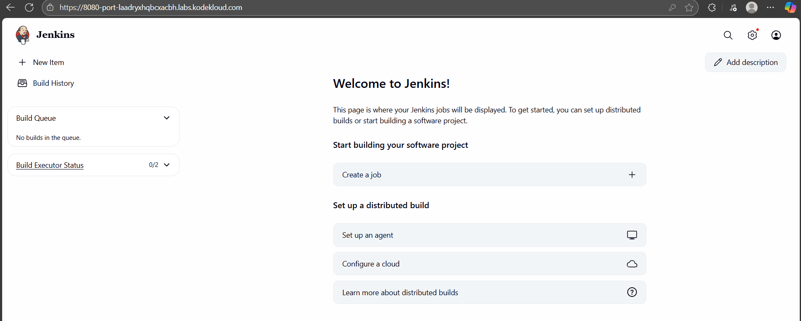

1. Install Jenkins on the jenkins server using the yum utility only, and start its service.

If you face a timeout issue while starting the Jenkins service, refer to this.
2. Jenkin's admin user name should be theadmin, password should be Adm!n321, full name should be Mark and email should be mark@jenkins.stratos.xfusioncorp.com.

Note:

1. To access the jenkins server, connect from the jump host using the root user with the password S3curePass.

2. After Jenkins server installation, click the Jenkins button on the top bar to access the Jenkins UI and follow on-screen instructions to create an admin user.

# Install wget 
yum install wget -y

# Install Jenkins 
https://www.jenkins.io/doc/book/installing/linux/#red-hat-centos    # Documentation for installation

sudo wget -O /etc/yum.repos.d/jenkins.repo     https://pkg.jenkins.io/redhat-stable/jenkins.repo
sudo rpm --import https://pkg.jenkins.io/redhat-stable/jenkins.io-2023.key
sudo yum upgrade -y
sudo yum install fontconfig java-21-openjdk jenkins -y
systemctl enable --now jenkins
systemctl status jenkins

# Install Jenkins plugin and admin setup
cat /var/lib/jenkins/secrets/initialAdminPassword
        # Fill initialAdminPassword

     # Install plugin

       # Create admin

      # Success login
