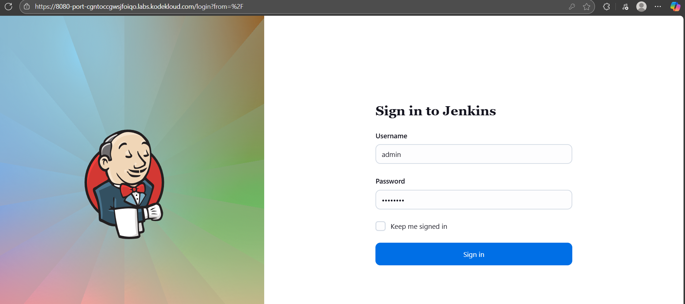
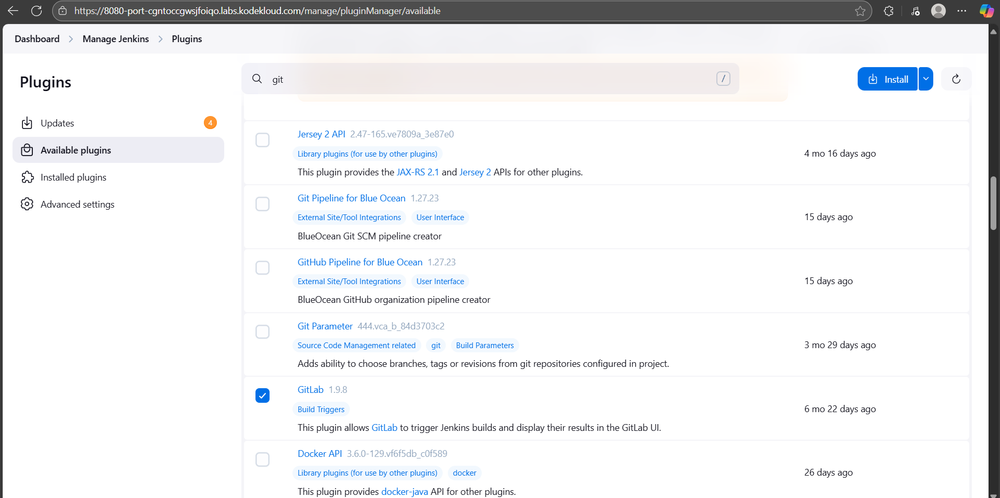
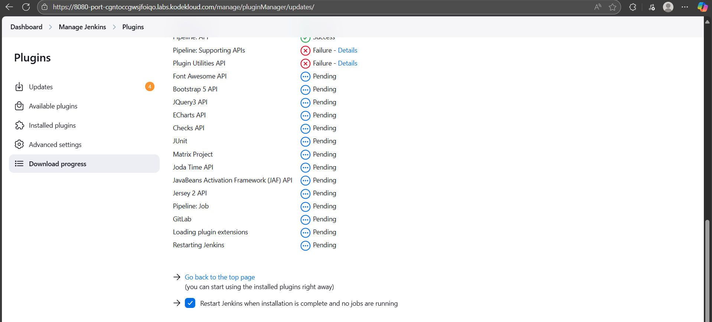
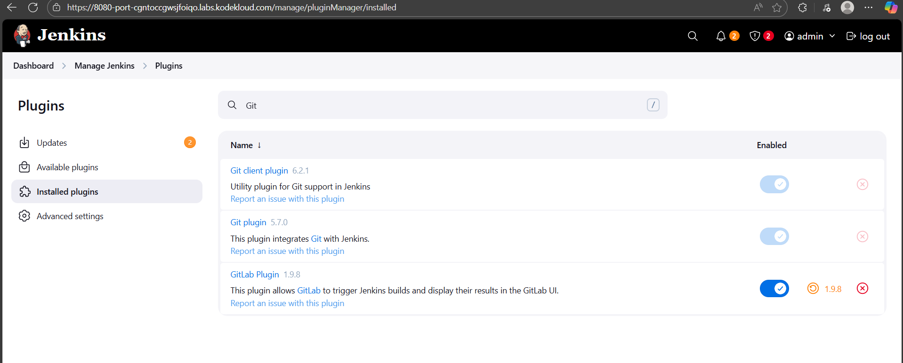

Task:
1. Click on the Jenkins button on the top bar to access the Jenkins UI. Login using username admin and Adm!n321 password.

2. Once logged in, install the Git and GitLab plugins. Note that you may need to restart Jenkins service to complete the plugins installation, If required, opt to Restart Jenkins when installation is complete and no jobs are running on plugin installation/update page i.e update centre.

# Login Jenkins server

# Install Git and Gitlab plugin

    # Restart Jenkins

# Successful installation
