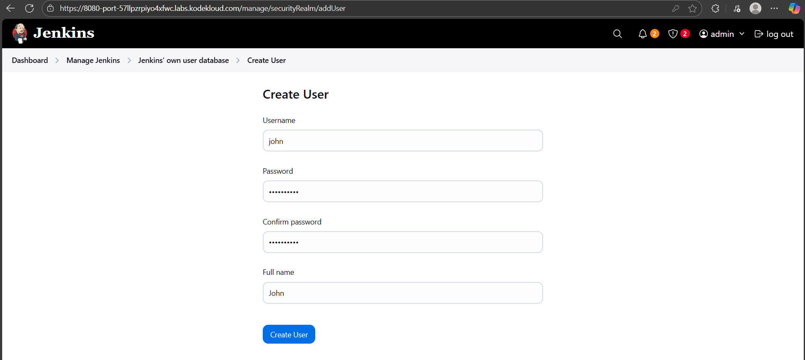
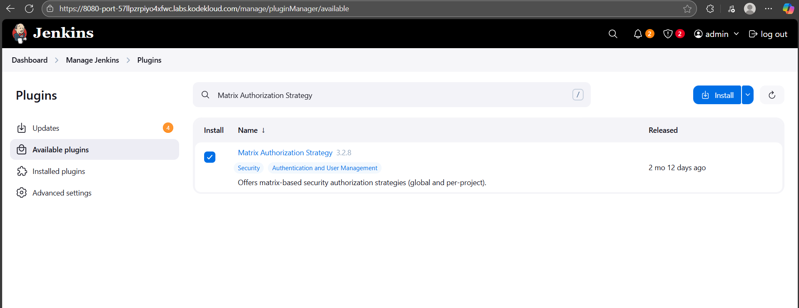
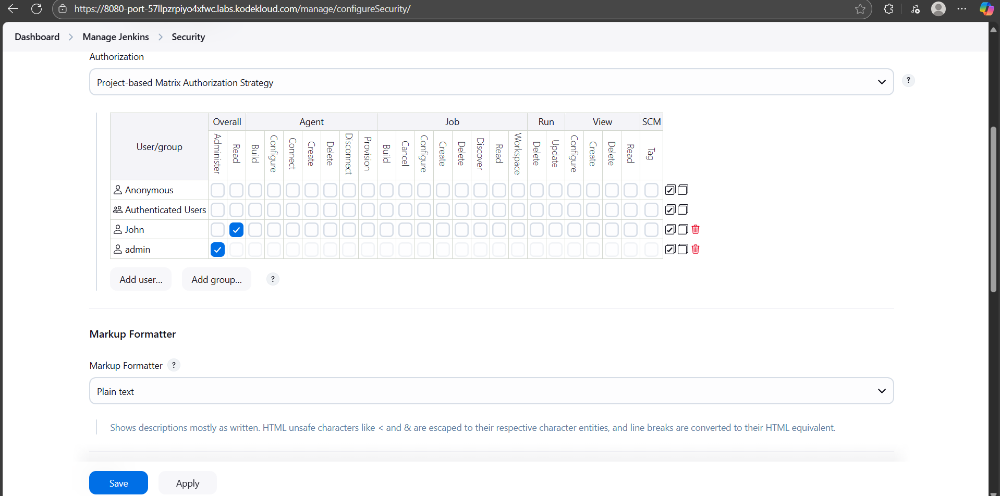
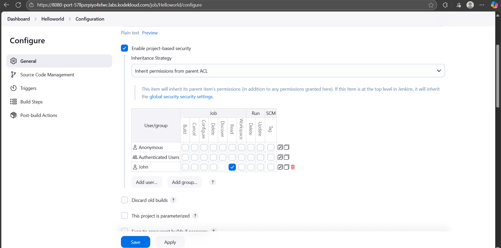

Task:
1. Click on the Jenkins button on the top bar to access the Jenkins UI. Login with username admin and password Adm!n321.

2. Create a jenkins user named john with the passwordYchZHRcLkL. Their full name should match John.

3. Utilize the Project-based Matrix Authorization Strategy to assign overall read permission to the john user.

4. Remove all permissions for Anonymous users (if any) ensuring that the admin user retains overall Administer permissions.

5. For the existing job, grant john user only read permissions, disregarding other permissions such as Agent, SCM etc.

# Create new user

# Install plugin and user permission

# Add user permission for existing project

