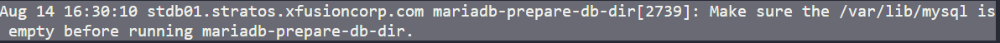

Task : To fix mariadb error

cmd >> sudo systemctl status mariadb.service         #Check mariadb status, service is running or not
cmd >> sudo journalctl -xeu mariadb.service    #Check mariadb error by journalctl

            #Not found direcotry /var/lib/mysql

cmd >> sudo mkdir /var/lib/mysql               #Create folder
cmd >> sudo chown -R mysql:mysql /var/lib/mysql         #Set owner permission
cmd >> sudo systemctl start mariadb.service